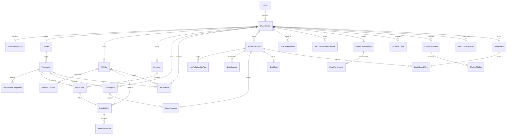

# PAN-74: relational player persistence

This is the M3.5 schema contract, reviewed against the current M2/M3 code. It provides storage and integrity rules for downstream feature tickets; it does not introduce authenticated gameplay endpoints or switch the browser to server saves. Babylon continues to own transient simulation.

## Content and instance identity

Canonical cars, parts, jobs, races, NPCs, crews, locations, opportunity rules, and chapter definitions remain versioned TypeScript/content data. There are no mutable definition tables. References are stable strings, validated against the server's pinned content catalog by domain services. Actual current IDs include `banwa_dalagan_1996`, `used_coilovers_01`, `kyo_ice_run`, `barangay_sprint`, `mang_boy`, `casey`, `iloilo_scene`, and `kyo_regulars`. Ticket examples such as `starter_lancer_01` are illustrative, not replacements for existing IDs.

User, player, vehicle instances, owned parts, receipts, job rows, race rows, commands, and social events have UUID primary keys generated by Prisma. A vehicle definition ID is not an owned vehicle ID: multiple copies of the same car are allowed. Logical subject tables use composite player/content primary keys. Server-issued job run IDs and race attempt IDs are unique per player and cannot be reused for a different run. Do not regenerate IDs from display names. Never reuse retired content IDs for a different definition.

`User(identityProvider, identitySubject)` identifies a user uniquely; one `PlayerProfile` per user is enforced by `userId`. Auth provider/session behavior belongs to the identity ticket; these fields alone are not authentication. `PlayerProfile.activeVehicleId` references a vehicle owned by that same player. Display name is not an identity key.

## Storage decisions and feature review

| Current persistent state / source | Storage decision |
| --- | --- |
| User/profile; garage active-car selection | `User`, `PlayerProfile`, owner-checked optional active vehicle |
| VehicleSession wallet and transaction history; `game-core/economy/economy.ts` | One `Wallet` per player, append-only `Transaction` with ordered sequence, exact amounts, before/after balances, source/reference/line, request ID, optional owner-checked vehicle; repair components in `TransactionComponent` |
| VehicleSession owned cars, revision, fuel; `vehicles/VehicleDefinition.ts` | `Vehicle` instance references immutable `definitionId`; one `VehicleCondition` snapshot with all nine condition components, fuel, and revision |
| InventorySession appearance and spoiler mode | Vehicle paint, ride-height offset, stock-spoiler removal; never mesh/socket transforms |
| InventorySession physical parts, origins, reveals, refinishes | One `Inventory` per player; individual `OwnedPart` copies with definition ID, condition/reveal/finish, provenance, amount paid, optional owner-checked receipt |
| InventorySession installed map, including coilovers/headlight pairs | One `InstalledPart` per physical item; `InstalledPartSlot` occupies one slot per vehicle. Multi-slot items share one installation, so they cannot span vehicles |
| InventorySession acquisition keys and retiredKeys | Unique `(playerId, acquisitionKey)` retained on a soft-retired `OwnedPart`; sold/scrapped items never lose replay protection |
| JobSession current run and outcome counts; `jobs/jobs.ts` | `JobProgress` per run, objective index, elapsed milliseconds, cargo state, terminal reason/time and optional payout receipt. History counts derive from terminal runs; partial unique index allows only one accepted/active run per player |
| Race.ts results; social race attempts / rivalHistory.ts | `RaceResult` records the attempt from `started` through `win/loss/dnf`, route, owned vehicle, rival content IDs, time/position, receipt and timestamps. Unique player/attempt protects duplicate completion |
| SocialState NPC introductions, trust, respect, flags, significant events | `NpcRelationship`, unique flags in `NpcRelationshipFlag`, ordered significant events in `NpcMilestone`; one relationship per player/NPC |
| SocialState favor progress and NPC favorIds | `FavorProgress` references the player's NPC relationship and optional same-owner job run. Favor IDs derive from these rows |
| SocialState scene reputation and reputationRewards | `SceneReputation`, `ReputationRewardSource` with per-player source count; tiers and content-specific caps/limits derive from current rules |
| SocialState crews, invitations, membership, joins | `PlayerCrewStanding` stores discovery/invitation/standing. `CrewMembership` stores status/joins/times; both unique per player/crew. Partial unique index allows one active crew |
| SocialState appliedEvents, duplicate/repeat guards | `SocialEvent` retains unique event ID and source key, canonical input fingerprint, type/subject/context/reason and optional reputation delta. `SocialEventEffect` stores NPC deltas/flag changes and references the same owner's relationship |
| Rival met state and historical outcomes | `RivalState` identifies the player's rival/build and hub meeting. Attempts, wins/losses/DNFs, latest outcome derive from `RaceResult`; no second mutable win counter |
| Social unlocks plus location/content access | `LocationUnlock` represents an acquired unlock; absence means locked. `unlockId` may be an opportunity/favor/content gate; optional `locationContentId` is only for physical locations. Source/reference traces the award |
| Chapter 1 current beat and completed markers | `ChapterProgress` and individually unique `ChapterMarker` rows, scoped by player/chapter; content beat order is server-validated |
| Save/database compatibility and import marker | Global `SchemaVersion`, per-player `PlayerSaveVersion` with schema/content version, monotonic revision, one-time import key/time |
| Retried mutating commands | `IdempotencyRecord`, unique player/scope/key, canonical request SHA-256 hash, correlation ID, status/resource and versioned narrow response |
| MarketplaceSession generated listing board/seed/serial | Temporary board generation/expiry is not canonical progression and is intentionally regenerated. Purchases retain listing/seller/grade/actual condition and receipt on owned parts; future server listing reservations need a separate validated design |
| HUD, offers/quotes/errors, UI selections, audio/graphics settings | HUD/quotes stay transient; device preferences stay local. No database rows |

The review included `maintenance/VehicleSession.ts` (local save v2), `inventory/InventorySession.ts` (v1), `jobs/JobSession.ts` (v1), `marketplace/MarketplaceSession.ts` (v1), `social/contract.ts` and `SocialSession.ts` (v4 with v1–v3 restoration), `social/crews.ts`, `social/reputation.ts`, `social/rivalHistory.ts`, `exterior/VehicleAppearance.ts`, `vehicles/VehicleDefinition.ts`, `game/races/Race.ts`, and garage selection storage. The runtime state stores primarily expose views/commands; they are not new database entities.

## Numeric and integrity rules

Money is signed PostgreSQL `BIGINT` centavos: PHP 1.00 = 100 centavos. This matches the existing economy's centavo arithmetic. A wallet cannot be negative. Transactions store nonzero signed delta and nonnegative before/after amounts, with a SQL equality check. The integer range is PostgreSQL's signed 64-bit range; domain commands must reject overflow before commit. Prisma exposes `bigint`: serialize centavos as decimal strings in future DTOs. Never `JSON.stringify` raw Prisma objects or cast arbitrary `bigint` to `number`. Any compatibility adapter to the current number-based client must check safe integer bounds and centavo round trips. No monetary float/decimal division is authoritative.

The ledger has unique `(playerId, sequence)` and `(playerId, source, sourceReference, sourceLine)`. A source reference identifies the actual action/run/receipt, not just the reusable job definition. `sourceLine` permits explicit multi-line settlement such as payout/refund; assigning random lines to evade duplicate protection is forbidden. Receipts include kind, description, timestamp, request ID and optional vehicle/components. Job/race payout pointers enforce receipt ownership; the domain service also validates receipt kind/source/amount.

SQL triggers make the ledger append-only, require contiguous sequences/opening balances, and lock the wallet to serialize appends. Deferred consistency triggers require the wallet's final balance/revision to match the final ledger balance/sequence at commit. To credit/debit, lock/read the wallet and insert receipt plus wallet update inside the same Prisma transaction; revision equals the resulting sequence. A direct wallet update without a matching receipt, or a receipt without a wallet update, fails. Use reversal entries for corrections. Initial wallets start at zero; starting cash requires a ledger grant. Administrative destructive operations are outside the app protocol and must never be exposed as gameplay commands.

Condition and cargo values use bounded `Decimal(9,8)` fractions; fuel uses `Decimal(9,3)` liters; stance uses `Decimal(5,3)` meters. API/domain validation must reject excess precision if rounding would matter. Fuel capacity, compatible slots/parts, NPC/favor catalogs, reputation cap (currently 160), reward limits, invitation eligibility, crew rejoin limits (currently one rejoin), and chapter order remain content/domain rules, not frozen database tuning. Trust/respect are constrained to 0–100. Race elapsed time is integer milliseconds; job snapshots convert elapsed seconds to milliseconds explicitly. No per-frame updates are required.

All foreign keys use explicit `RESTRICT` on delete and update. Removing an identity/player/vehicle must not silently delete history. Users/players/vehicles/parts have deactivation/archive/retirement timestamps. Hard erasure requires a separate audited lifecycle design. Domain services reject retired vehicles/parts; removal of installations and slots is explicit and atomic. Non-ledger mutable projection changes remain authorized domain operations, not public arbitrary row editing.

Installed ownership is enforced at the database layer, including each slot's exact installation/player/vehicle tuple. The database enforces at most one vehicle per part and one item per slot. The domain service enforces all required slots of a multi-slot definition, compatibility, removal of displaced parts as a unit, and forbids installing retired parts. Physical parts are the current inventory; do not add another item copy with independent ownership/condition.

Closed lifecycle states (job/race outcomes, invitation/membership/favor/command status, provenance/reveal/finish/grade) use PostgreSQL enums mirrored by Prisma. Add or rename enum values through explicit migrations with compatibility handling. Extensible content identifiers, slots, transaction categories, and source kinds remain strings validated by versioned catalogs/domain code; they do not require enum migrations for each new content item.

Important indexes cover active owned vehicles/parts, wallet history by player/time, receipt sources/sequences, job history/status per content ID, recent races, rival attempts, per-NPC events, social event source/subject queries, unlocks, and pending commands. Composite player/content primary keys support bootstrap queries. SQL partial unique indexes encode the active job/crew constraints that Prisma cannot represent. Keep the SQL constraints/triggers/indexes when evolving this schema; `db push` is not a migration substitute.

## Schema evolution and rollout

PAN-74 introduced database version **2** (the subsequent [auth migration](AUTH_BOOTSTRAP.md) advances database compatibility to **3** while saves remain version 2); migration `20260927010000_player_state` preserves the foundation metadata row, adds relational tables/constraints atomically, then advances its version. API readiness requires exactly the supported global version, so mismatched app/database releases do not report ready. The original foundation migration remains unchanged.

Each new player gets save schema version 2 and a content manifest version supplied by the bootstrap/identity service. `PlayerSaveVersion.revision` advances with successful durable commands, independently of wallet/condition revisions. Do not increment a save version per frame or invent a version by copying a client input. Database migration history is authoritative; metadata is a compatibility marker, not a replacement for migrations.

Additive compatible schema changes need a committed migration and fresh/upgraded database tests. Breaking DTO/save meaning or structure also needs a new save version, deterministic backfill/transform, representative old-state fixtures, explicit compatibility gate, and rollback/recovery notes. Content ID renames require a mapping and migration of all affected references; removing content requires tombstones/legacy mapping. Use expand → backfill → switch readers/writers → contract for live deployments. Do not modify already-applied migrations, rely on manual SQL, or run destructive resets in CI/deployment. Roll back incompatible app releases only while their schema/DTO contracts remain compatible; restoring a backup or a forward repair is the recovery plan for incompatible data changes.

No real player rows exist in the foundation v1 database. Upgrading v1 therefore preserves metadata and creates empty player tables; no player seed is required. Tests create representative temporary players/receipts/parts/social/job/race data using actual content IDs and roll fixtures back. The idempotent infrastructure seed does not overwrite versions or grant money.

Browser save transition is a later, explicitly scoped ticket. The known keys are `pang-daily.vehicle-session.v1` (payload v2), `pang-daily.inventory.v1` (v1), `pang-daily.job-session.v1` (v1), `pang-daily.marketplace.v1` (v1), `pang-daily.social-session.v1` (v4), and `pang-daily.active-car.v1`. The key suffix is not the payload version. Vehicle/wallet/inventory/job/social state is structurally mappable; instance IDs and references need remapping and ledger amounts must validate. Marketplace ephemeral boards, quotes, UI state, and transient driving samples are discarded. Rival history should map validated attempts rather than replay rewards.

For the first development rollout, the proposed policy is an explicit clean progression reset with user-facing notice; local progression is not a trusted production import. If a development import is selected in that ticket, it must be one transaction for a first-time player, recorded by a unique import key/time, and must never overwrite an existing server save. On failure, roll back all imported rows and leave the local source untouched; retries use the same import key. This ticket only establishes the storage/version contract, not the import UI or adapter. Do not maintain two permanent canonical saves.

Idempotency claims and their domain mutations commit in one transaction. Compare the stored request hash on reuse; reject a reused key with a different request. Do not commit a `pending` claim ahead of the mutation without an explicit recovery protocol. Keep unique domain run/acquisition/source keys even if narrow cached responses are eventually pruned. JSON is allowed only for this versioned command response, never a whole player bootstrap/save or an arbitrary domain persistence escape hatch.

## Relationships



One-to-one dependent rows are optional in the physical schema so bootstrap can initialize them atomically; the future bootstrap service must create wallet, inventory, version and starter condition exactly once before returning a playable profile. Nullable payout relations accommodate zero-award finishes; domain settlement validates actual reward rules.

## Verification commands

From the repository root:

```bash
yarn db:generate
yarn db:deploy
yarn test:api
yarn test:api:integration
yarn typecheck:api
yarn lint
```

For a separate empty PostgreSQL instance, set `API_TEST_ENV_FILE` to an API environment file with `NODE_ENV=test` and a dedicated database ending in `_test`, then run integration tests. The runner applies committed migrations and seeds twice. Tests exercise exact centavos, representative relational state, owner-checked installations/receipts, duplicate subjects/runs/attempts/commands/acquisitions, active job/crew limits, condition ranges, restrictive deletion, ledger drift/immutability and database version/indexes. They do not require table creation outside migrations.

The economy/garage follow-up migration advances database compatibility to 4, retaining player save version 2. See [ECONOMY_GARAGE.md](ECONOMY_GARAGE.md) for transactional commands, market listing storage and race checkpoint validation.
